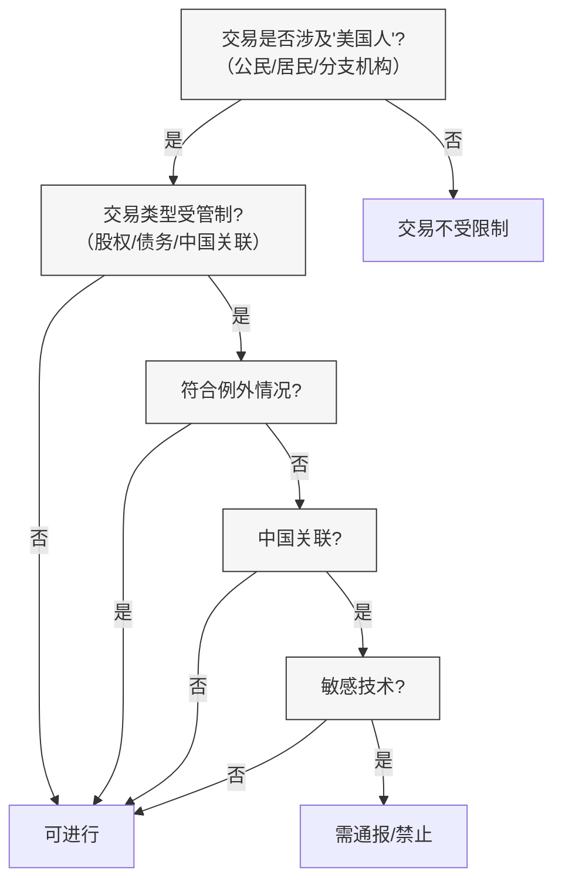

```mermaid
graph TD
    A["交易是否涉及'美国人'?\n（公民/居民/分支机构）"] -->|是| B["交易类型受管制?\n（股权/债务/中国关联）"]
    A -->|否| RESULT1["交易不受限制"]
    B -->|是| C["符合例外情况?"]
    B -->|否| RESULT2["可进行"]
    C -->|是| RESULT2
    C -->|否| D["中国关联?"]
    D -->|是| E["敏感技术?"]
    D -->|否| RESULT2
    E -->|是| RESULT3["需通报/禁止"]
    E -->|否| RESULT2

    classDef decision fill:#f6f6f6,stroke:#333
    class A,B,C,D,E decision
    class RESULT1,RESULT2,RESULT3 result
```
